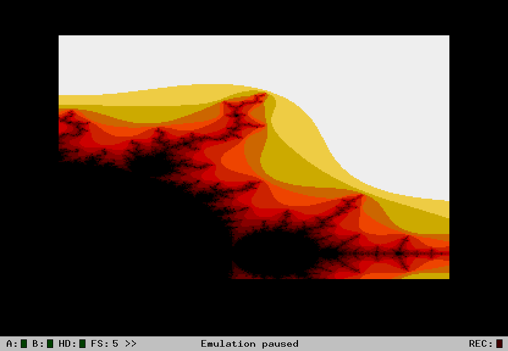
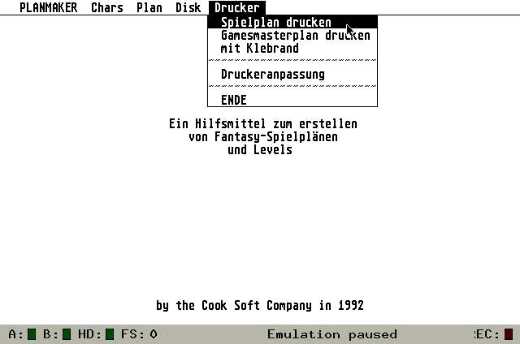
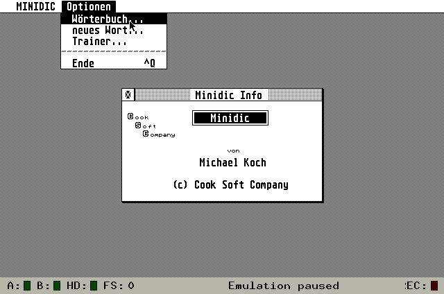

Atari ST Program Archive
========================

# Introduction and overview

This is an archive of my Atari ST programs from the early 1990s. I don't think they will be useful to anybody, they just serve as backup of my personal history and as a showcase of my first steps at programming. I hope you'll find them mildly amusing.

I have always intended to publish my programs as open source (_public domain_ was the more commonly used term then). Back then the only distribution form available to me was mail-order floppy disks.

The folder *atarist* contains the original program files as copied from my old 3.5" floppy disks. Most of the programs are written in [Omikron Basic](http://de.wikipedia.org/wiki/Omikron_BASIC), which was bundled with the Atari ST by the time I got mine (a 1040 STFM). You can add the folder as a virtual GEMDOS drive in emulators like [Hatari](http://hatari.tuxfamily.org/).

Omikron Basic uses a binary format to store the files. These files can only be read by loading them into the Omikron Basic editor in an emulator. The folder *sources* contains dumps of the Basic programs as text files. You can look at them to get an impression (hopefully not too bad) of how I started out as a programmer.

*media* contains screenshots of the programs. All screenshots and movies were created using Hatari to run the original software.

# The Programs

I've listed the programs in roughly cronological order (at least as far as I can remember). I couldn't rescue all programs. Some disks were broken, others were lost. Fortunately, I could rescue the ones which were most important to me.

## 3D

[3D.BAS](sources/3D.BAS)

Plots a mathematical function as 3 dimensional graph. Like many of the other programs this was adapted from an article/listing in [Happy Computer](http://de.wikipedia.org/wiki/Happy_Computer).

## Fracrand

Traces the border of the [mandelbrot set](http://en.wikipedia.org/wiki/Mandelbrot_set) along the boundary.

[FRACRAND.BAS](sources/FRACRAND.BAS)

## Fractal

Draws colorized pictures of the mandelbrot set. Fractals sure were popular at the time.

[FRACTAL.BAS](sources/FRACTAL.BAS)

## Fraktalsee

Draws the mandelbrot set as a 3D picture, creating the effect of a landscape. This is adapted from a listing in Happy Computer.

[FRACSEE.BAS](sources/FRACSEE.BAS)

## Funktionsplotter

[FUNKTION.BAS](sources/FUNKTION.BAS)

Plot a mathematical function in a coordinate system on screen. A nice homework helper at a time when math classes were still pen and paper only.

## Bildwandler

[CHANGEFM.BAS](sources/CHANGEFM.BAS)

Converts a 16 color image to black and white by applying a dithering algorithm. I've likely learned the algorithm from a [64'er](http://de.wikipedia.org/wiki/64er) special issue about computer graphics.

## Picture Drucker

[PICDRUCK.BAS](sources/PICDRUCK.BAS)

## Posterdrucker

[POSTER.BAS](sources/POSTER.BAS)

## Readmemaker

[READMEMA.BAS](sources/READMEMA.BAS)

## Core Wars / Krieg der Kerne

[WAR.BAS](sources/WAR.BAS)

## CSC Animator

[CSCANIMA.BAS](sources/CSCANIMA.BAS)

## Planmaker

[PLANMAKE.BAS](sources/PLANMAKE.BAS)

## Running Points

[R_POINTS.BAS](sources/R_POINTS.BAS)

## Wörterbuch

[sources](atarist/WOERTER/)

What does a programmer do if he wants to learn a foreign language? He writes a language learning program. _Wörterbuch_ is a vocabulary trainer. This is one of my first C programs. Having to reload everything from floppy disk when your C program crashes the operating system really teaches you to make no mistakes.

My later, more elaborate language learning program is [JGloss](http://jgloss.sf.net/).

## Ultimate C Editor (UCE)

[sources](atarist/WOERTER/)

## Diskdump

[DISKDUMP.BAS](sources/DISKDUMP.BAS)

