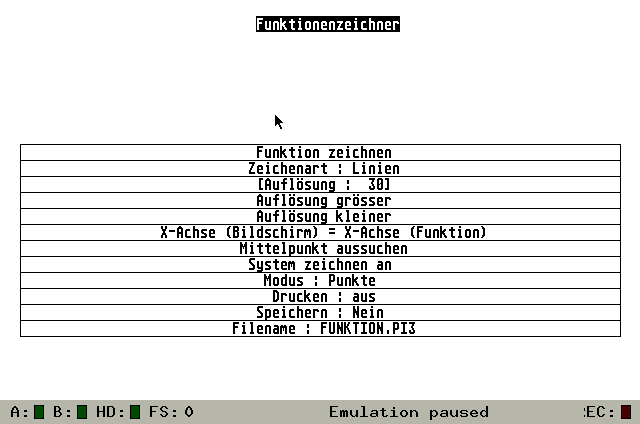
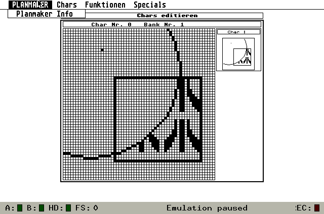

My Personal Atari ST Program Archive
====================================

# Introduction and overview

This is an archive of my Atari ST programs from the early 1990s. I don't think they will be useful to anybody, they just serve as backup of my personal history and as a showcase of my first steps at programming. I hope you'll find them mildly amusing.

I have always intended to publish my programs as open source (_public domain_ was the more commonly used term then). Somehow, I never got around to doing it until now. Back then the only distribution form available to me was mail-order floppy disks.

The folder *atarist* contains the original program files as copied from my old 3.5" floppy disks. Most of the programs are written in [Omikron Basic](http://de.wikipedia.org/wiki/Omikron_BASIC), which was bundled with the Atari ST by the time I got mine (a 1040 STFM). You can add the folder as a virtual GEMDOS drive in emulators like [Hatari](http://hatari.tuxfamily.org/).

Omikron Basic uses a binary format to store the files. These files can only be read by loading them into the Omikron Basic editor in an emulator. The folder *sources* contains dumps of the Basic programs as text files. You can look at them to get an impression (hopefully not too bad) of my first programming steps.

*media* contains screenshots of the programs. All screenshots and movies were created using Hatari to run the original software.

# The Programs

I've listed the programs in roughly cronological order (at least as far as I can remember). I couldn't rescue all programs. Some disks were broken, others were lost. Fortunately, I could rescue the ones which were most important to me.

## 3D

[3D.BAS](sources/3D.BAS)

Plots a mathematical function as 3 dimensional graph. Like many of the other programs this was adapted from an article/listing in [Happy Computer](http://de.wikipedia.org/wiki/Happy_Computer).

## Fracrand

[FRACRAND.BAS](sources/FRACRAND.BAS)

Draws the border of the [mandelbrot set](http://en.wikipedia.org/wiki/Mandelbrot_set) along the boundary.

## Mandeldraw

Draws colorized pictures of the mandelbrot set. Fractals sure were popular at the time. By the way, CSC is the _Cook Soft Company_, the name under which I wanted to publish my software.

[FRACTAL.BAS](sources/FRACTAL.BAS)

## Fraktallandschaften

Draws the mandelbrot set as a 3D picture, creating the effect of a landscape. This is adapted from a listing in Happy Computer.

[FRACSEE.BAS](sources/FRACSEE.BAS)

## Funktionenzeichner

[FUNKTION.BAS](sources/FUNKTION.BAS)

Draws coordinate systems and plots a mathematical function. A nice homework helper at a time when math classes were still pen and paper only.

## Bildwandler

[CHANGEFM.BAS](sources/CHANGEFM.BAS)

Converts a 16 color image to black and white by applying a dithering algorithm. I've likely learned the algorithm from a [64'er](http://de.wikipedia.org/wiki/64er) special issue about computer graphics.

## Picture Drucker

[PICDRUCK.BAS](sources/PICDRUCK.BAS)

Prints an image (no surprise here). Printing bitmaps at the time meant writing the printer-specific control sequences to the serial port, not using any kind of printer driver.

## Posterdrucker

[POSTER.BAS](sources/POSTER.BAS)

Prints an image scaled to poster size.

## Readmem-Maker

[READMEMA.BAS](sources/READMEMA.BAS)

A text editor which I wrote to write the README files for my other programs. I can't remember why I felt the need to write my own editor instead of using an existing word processor like 1st Word Plus. Probably because I could.

_"Even a perfect program still has bugs.", The Tao of Programming_

## Krieg der Kerne

[WAR.BAS](sources/WAR.BAS)

[Core Wars](http://en.wikipedia.org/wiki/Core_wars) is another idea popular in the computer world which I learned about from Happy Computer. Two programs compete in an "arena" of memory cells, each trying to overwrite the other.

## CSC Animator

[CSCANIMA.BAS](sources/CSCANIMA.BAS)

A 3D animation software. You can draw polygons and then animate them by applying simple transformations. I can't remember where I learned about the algorithms.

[Demo Video](https://www.youtube.com/watch?v=kdeKgEstNao)

## Planmaker

[PLANMAKE.BAS](sources/PLANMAKE.BAS) | [README](atarist/PLANMAKE.R/DATAS/PRGDATAS/PLANMAKE.TXT)

A game plan editor for [Hero Quest](http://en.wikipedia.org/wiki/Hero_quest), a cross between board game and RPG which we played at the time. You can paint tiles and then combine them to the game plan. Stripes of the plan are printed on continuous paper, which you had to glue together to complete the plan. If I remember correctly, a completed plan was about 2x1m in size.

As with most of my programs, writing it was far more interesting than actually using it. I thing we had already stopped playing Hero Quest at the time I finished the program.

## Running Points

[R_POINTS.BAS](sources/R_POINTS.BAS) | [README](atarist/R_POINTS/R_POINTS.TXT)

A Tron clone with extras, level editor and computer players.

[Demo Video](https://www.youtube.com/watch?v=fhKZ_MPWtLQ)

## Minidic

[sources](atarist/WOERTER/)

What does a programmer do if he wants to learn a foreign language? He writes a language learning program. _Minidic_ is a dictionary and vocabulary trainer. This is one of my first C programs. Having to reload everything from floppy disk when your C program crashes the operating system really teaches you to make no mistakes.

My later, more elaborate language learning program is [JGloss](http://jgloss.sf.net/).

## Ultimate C Editor (UCE)

[sources](atarist/UCE/)

A very ambitious title for a C source code editor written in C.

## Diskdump

[DISKDUMP.BAS](sources/DISKDUMP.BAS)

This is a little tool I wrote only recently to rescue the data on my ST disks. Although the disk format which the Atari ST uses is very similar to the MS-DOS format, my old PC floppy drives produced only read errors after all the years the disks had been stored in the attic. Fortunately, my ST which was stored in the same place could still read most of them.

Diskdump simply reads a floppy sector by sector and dumps the data to the serial port. On the PC end, I dumped the data read from the serial port in a file. The resulting files can be used by Hatari as disk images.

